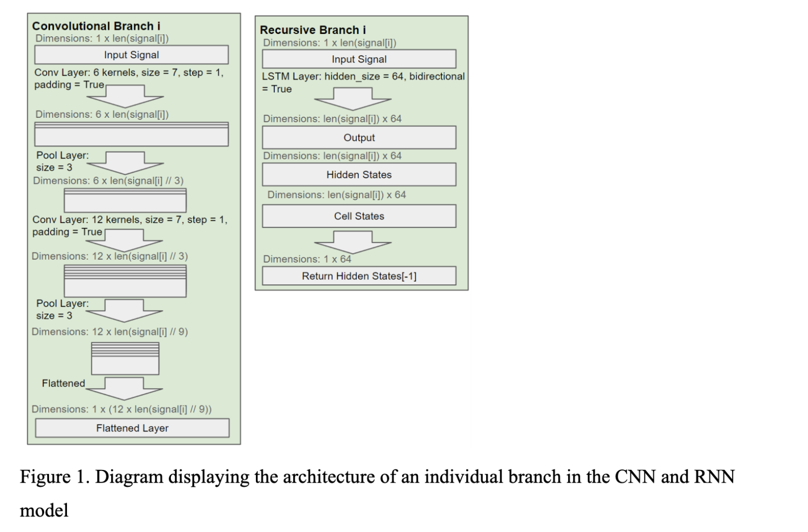
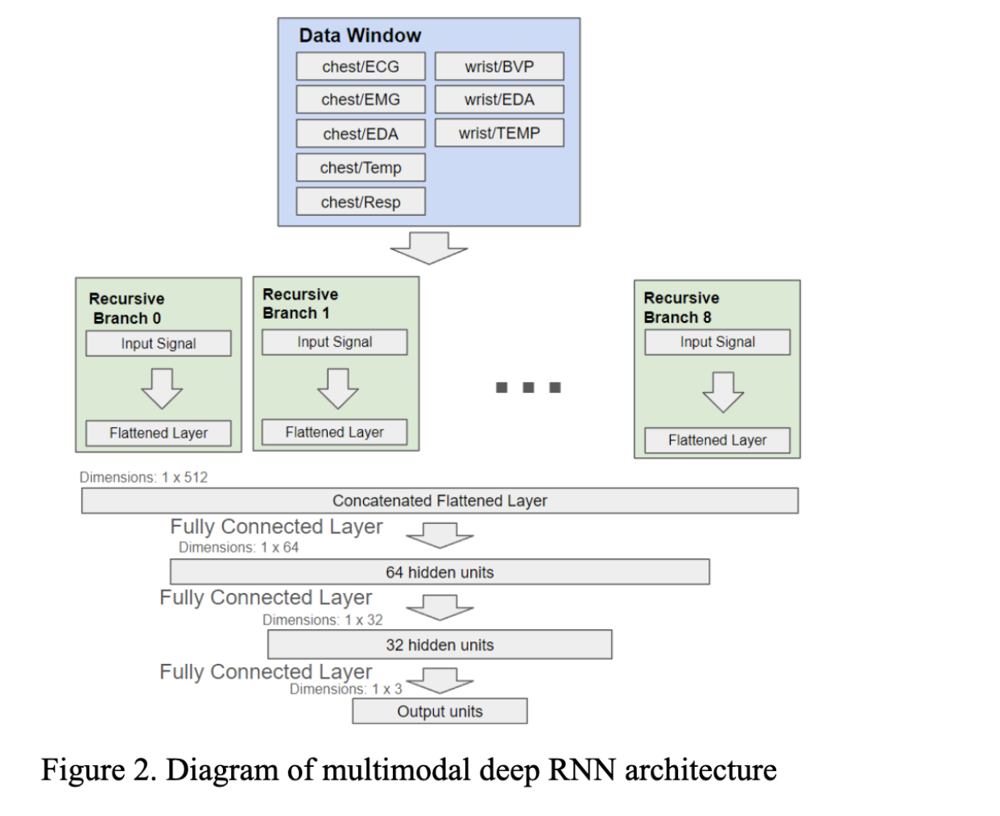
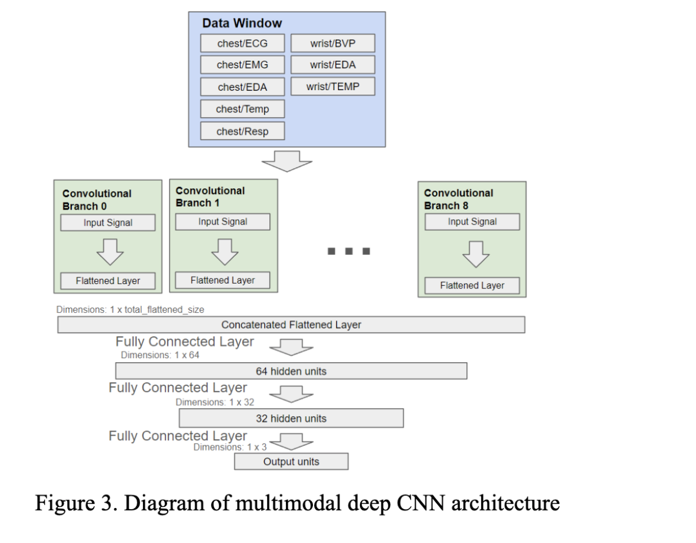

# Designing and Implementing CNN and RNN frameworks to categorize time-series biosignal data

If you would like the full run-down of this project, then I **highly** recommend that you check out the **"CS EE Final Draft - Google Docs.pdf"** file in this repository. It is an essay that goes into depth explaining the entirety of this project in an accessible manner.

To summarize the project, I trained 2 main types of deep neural network models, CNNs and LSTMs (RNNs), to classify data on a dataset called WESAD by Philip Schmidt, Atilla Reiss, et al. Within this dataset are 15 subjects who were monitored in terms of around 9 biosignals over the course of an experiment that lasted around an hour or two.

I designed a branched multimodal architecture for both types of networks, taking in multiple different biosignals as inputs, and using those to predict the affect states of subjects given a specific time window of 60 seconds.

I was able to train models that exhibited around a 88% test accuracy in LOSO cross-validation, although it was clear that these models were better at predicting based on test cases from certain subjects over others. This test accuracy is higher than those for the models used in the original WESAD paper, but it is worth noting that the deep learning models used in this project were likely significantly more computationally expensive than the ML methods used originally.

Below are some diagrams made during the project in an attempt to explain the model architecture/pipeline that I designed:

